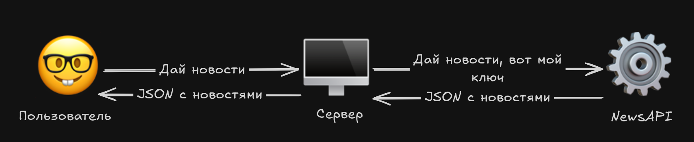

# Учебная практика

## Задание:
Прототип новостного сайта

**Требования к функционалу:**
- Просмотр новостей
- Добавление новостей в избранное (хранение в local storage)
- Поиск новостей


**Требования к исполнению**:
- JavaScript,  TypesScript или Nodejs
- Можно использовать любые библиотеки, фреймворки на выбор
- Web интерфейс
- README.md файл:
  - Название вашего сайта (сами придумайте)
  - Описание сайта
  - Как скачать проект
  - Как запустить проект
- Опубликовать код на github.com или аналогах
- Развернуть сайт

---
# Прелюдия

Разъяснение тем, которые имеют косвенное отношение к разработке проекта

## Git

**Git** - система контроля версий. Мы можем сохранить все файлы в стабильном состоянии и если мы закосячим проект - откатиться

[Пройдите презу](./assets/git.pdf)

## env

У нас в проекте будут данные, которые мы не хотим выкладывать на всеобщее обозрение, такие данные принято хранить в env файлах. Их не принято добавлять в репозиторий git, чтобы чужие глаза из не увидели

Чтобы 100% .env файл не попал в git можно добавить его в файл .gitignore. Предположим проект:

```
├── .env
├── .gitignore
└── main.js
```

**.gitignote**
```
.env
```

Теперь точно git не будет следить за тем, что у нас в `.env`

Так как мы будем публиковать код на github каждый должен иметь возможность его попробовать. Но сейчас случайный прохожий не поймет что нужно вставлять в .env чтобы запустить код на своем компьютере. Для этого создают файл `.env.example` с примером того, что должно быть в .env, но без секретных данных. Чтобы `.env.example` точно попал в git его нужно исключить из `.gitignore`:

**.gitignote**
```
.env
!.env.example
```
  
>`!` показывает что gitignore не должен скрывать файл от 

# Написание

Это раздел на случай, если вы выполнить задание не в силах. Будет расписан процесс написания, но будут дополнительные вопросы. **README.md писать самим**


Новости мы будем просить у левого сайта. Он дает их не всем, а только тем, кто на этом сайте зарегистрирован. После регистрации нам дадут ключ, который нужно прикреплять к каждому запросу, чтобы он понимал, что это точно мы. Прикреплять ключ к запросам от клиента мы не можем, потому что он тогда ключ этот сможет подсмотреть и украсть. Держа это в голове, нам нужно пропускать запросы от пользователя через сервер, где мы будем прикреплять к нему ключ

## Стек
|Название      |Описание                                       |
|--------------|-----------------------------------------------|
|Node.js       |Для написания бекенда приложения на JavaScript |
|NewsAPI       |API с данными новостей                         |
|Express.js    |Упрощает написание бекенда                     |
|axios         |Запросы к API                                  |
|dotenv        |Работа с env файлами                           |
|nodemon       |Будет автоматически перезапускать сервер       |
|HTML, CSS, JS | Для фронтенда                                 |

## Написание

**Создадим проект и скачаем библиотеки:**
```bash
npm init -y
npm install express axios dotenv
npm install -D nodemon
```

### Подготовка

#### Настроим скрипты:
В файле `package.json` найдите **scripts** и перепишите по примеру:
  
**package.json**
```json
"scripts": {
  "start": "node src/server.js",
  "dev": "nodemon src/server.js",
},
```
  
**Это добавит в проект команды:**
1. `npm start` - запуск проекта
2. `npm run dev` - запуск проекта, но он будет автоматически обновляться от обновления файлов

---

### Создадим env файлы

Чтобы получать новости мы будем использовать NewsAPI. Для этого нам нужно [зарегистрироваться на сайте](https://newsapi.org/register) и получить ключ.

За бесплатно у нас есть ограниченое количество запросов и нужно чтобы никто наш ключ не украл. Создадим файл `.env` с ключем от api и портом, на котором запускается приложение:

**.env**
```
NEWS_API_KEY=вставьте_ключ_от_newsapi
PORT=3000
```

**Замените `вставьте_ключ_от_newsapi` на ключ от newsapi**

Так как нам нужно будет опубликовать код на github - нужно добавить git в проект

**.env.example**
```
NEWS_API_KEY=вставьте_ключ_от_newsapi
PORT=3000
```
 
Оставьте прям в таком виде, ничего не меняйте, пользователи github смогут увидеть этот пример env файла и сами заполнят необходимые данные

Осталось только сделать так чтобы git следил за `.env.example`, но пропускал `.env`. Для этого создадим файл `.gitignote`

**.gitignore**
```
.env
!.env.example
node_modules
```
**Это скажет git:**
1. Не добавляй `.env`
2. Добавляй `.env.example`, потому что из-за запрета на `.env` этот файл мог не попасть в git
3. Не добавляй `node_modules`. Зависимости проекта каждый будет скачивать сам, не надо добавлять из в git

## Напишем сам код

**Организуем код так:**
```
├── package.json
├── package-lock.json
├── public
│   ├── css
│   │   └── style.css
│   ├── index.html
│   └── js
│       └── app.js
└── src
    ├── app.js
    ├── controllers
    │   └── newsController.js
    ├── routes
    │   └── newsRoutes.js
    ├── server.js
    └── services
        └── newsService.js
```

Это пример **трехслойной архитектуры**. В приложении есть 3 слоя:
- **services (сервисы)** это алгоритмы и логика. На этом слое мы будем делать запросы к newsapi
- **controllers (контроллеры)** отвечают за организацию запроса. На этом слое принимается запрос, обрабатывыается и возвращается обратно
- **routes (маршруты)**. На этом слое привязываются контроллеры к конкретным адресам

Каждый слой отвечает за что-то свое и не мешает другим

```
Пользователь <--> Маршрут <--> Контроллер <--> Сервис
```

## Напишем бекенд

**src/services/newsService.js**
```js
const axios = require("axios");

async function getNews(query) {
  // Отправляем запрос на newsapi
  const response = await axios.get("https://newsapi.org/v2/everything", {
    
    // Передаем в запрос:
    params: {
      q: query, // Что мы ищем
      apiKey: process.env.NEWS_API_KEY, // api ключ
      pageSize: 10, // Сколько новостей нужно
    },
  });
  
  // Из всего ответа от newsapi нам нужны только articles (новости)
  return response.data.articles;
}

// Экспортируем функцию
// Чтобы ее можно было вызвать из другого файла
module.exports = { getNews };
```
**Это сервис, здесь написана логика работы с newsapi**
Функция `getNews` отправит запрос с темой которую мы ищием, ключем и количеством новостей на новостной сайт 

---

**src/controllers/newController.js**
```js
const { getNews } = require("../services/newsService");

async function searchNews(req, res) {
  try {
    
    // Получаем из запроса q
    // Это то, что пользователь введет в поиск
    const query = req.query.q;

    // Если запроса нет - ошибка
    if (!query) {
      return res.status(400).json({ error: "Query required" });
    }
    
    // Вызываем сервис
    const articles = await getNews(query);
    
    // Прикрепляем к ответу полученные новости
    res.json(articles);
  } catch (error) {
    res.status(500).json({ error: "Failed to fetch news" });
  }
}

// Экспортируем
module.exports = { searchNews };
```
**Это контроллер, он принимает запрос, обрабатывает и возвращает ответ**
Функция `searchNews` принимает в себя запрос от пользователя и ответ. Если в запросе нет темы новостей, которую ищет пользователь - вернем ошибку `400`. Получаем новости из функции `getNews` и крепим json с новостями к отвему. Если в процессе возникла ошибка - вернем ошибку `500`

---

**src/routes/newsRoutes.js**
```js
const express = require("express");
const { searchNews } = require("../controllers/newsController");

// Создаем router, в нем будут храниться все маршруты
const router = express.Router();

// Вызываем контроллер на главном маршруте
router.get("/", searchNews);

// Экспортируем
module.exports = router;
```
**Это маршрут, в нем прописано, какой контроллер на каком запросе будет выполняться**
Мы говорим, что на маршруте `/` будет срабатывать функция `searchNews`

---

**src/app.js**
```js
const express = require("express");
const path = require("path");
const newsRoutes = require("./routes/newsRoutes");

// Обрабатываем .env файлы
require("dotenv").config();

// Создаем приложение express
const app = express();

// Добавляем проддержку json для работы с ответами
app.use(express.json());

// Указываем папку со статичными файлами
app.use(express.static(path.join(__dirname, "../public")));

// Привязываем маршруты к /api/news
app.use("/api/news", newsRoutes);

// Экспортируем
module.exports = app;
```
**app.js собирает и настраивает приложение**
Мы подключаем статичные файлы из папки `public`, чтобы пользователь мог получать html, css, js. Прикрепляем новостные маршруты к маршруту `/api/news`

>**Важный момент**. Мы настроили статичные файлы. Если пользователь отправит запрос `/` на наш сайт - ему вернется `index.html`, потому что так устроен интернет. Если бы мы не добавили к маршрутам новостей `/api/news` эти 2 маршрута конфликтовали бы

---

**src/server.js**
```js
const app = require("./app");

// PORT будет такой же как в env, или 3000
const PORT = process.env.PORT || 3000;

// Запускаем приложение из app.js на выбранном порту
app.listen(PORT, () => {
  console.log(`Сервер запущен на http://localhost:${PORT}`);
});
```
В `package.json` мы указали, что все скрипты будут запускать этот файл. Он нужен чтобы прописать логику запуска приложения на сервере

---

## Написание фронтенда

**public/index.html**
```html
<!doctype html>
<html>
    <head>
        <title>News App</title>
        <link rel="stylesheet" href="css/style.css" />
    </head>
    <body>
        <div class="container">
            <h1>News Search</h1>

            <input id="searchInput" placeholder="Search news..." />
            <button id="searchBtn">Search</button>

            <h2>Results</h2>
            <div id="newsContainer"></div>

            <h2>Saved</h2>
            <div id="savedContainer"></div>
        </div>

        <script src="js/app.js"></script>
    </body>
</html>
```
Здесь главное создать элементы для ввода, отправки запроса и отображения результата

---

**public/css/style.css**
```css
body {
    font-family: Arial;
    background: #f4f4f4;
}

.container {
    width: 800px;
    margin: auto;
}

.article {
    background: white;
    padding: 15px;
    margin: 10px 0;
}

button {
    cursor: pointer;
}
```
Хотя-бы css напишите чтобы вам красиво было 💅💅💅

---

**public/js/app.js**
```js
// Получаем элементы со страницы
const searchBtn = document.getElementById("searchBtn");
const searchInput = document.getElementById("searchInput");
const newsContainer = document.getElementById("newsContainer");
const savedContainer = document.getElementById("savedContainer");

// Функция для получения сохраненных новостей
function getSavedNews() {
  return JSON.parse(localStorage.getItem("savedNews")) || [];
}

// Функция для сохранения новостей
function saveNews(article) {
  // Получаем сохраненные новости
  const saved = getSavedNews();

  // Добавляем к сохраненным новую новость
  saved.push(article);

  // Сохраняем в local storage
  localStorage.setItem("savedNews", JSON.stringify(saved));

  // Отображаем сохраненные новости
  renderSavedNews();
}

// Отображение сохраненных новостей
function renderSavedNews() {
  // Получаем сохраненные новости
  const saved = getSavedNews();

  // Кладем в saved container новости в виде html
  savedContainer.innerHTML = saved
    .map(
      (article) => `
      <div class="article">
        <h3>${article.title}</h3>
      </div>
    `,
    )
    .join("");
}

// Обработка нажатия на кнопку поиска
searchBtn.addEventListener("click", async () => {
  // Получаем текст из поля ввода
  const query = searchInput.value;

  // Отправляем запрос, получаем ответ
  const res = await fetch(`/api/news?q=${query}`);

  // Из всего ответа нам нужен только json
  const articles = await res.json();

  // Отображаем новости в news container
  newsContainer.innerHTML = articles
    .map(
      (article) => `
      <div class="article">
        <h3>${article.title}</h3>
        <p>${article.description || ""}</p>
        <button onclick='saveNews(${JSON.stringify(article)})'>Save</button>
      </div>
    `,
    )
    .join("");
});

// Отображаем сохраненные новости
renderSavedNews();
```
